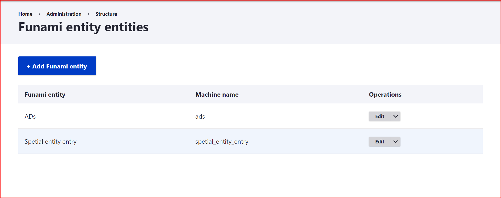

# Funami Entity Special
> An entity module generated from drupal console.

Creates a special entity accessible in **/admin/structure**



## Installation

```sh
git clone git@github.com:harakiri-cat/fu_entity_special.git
drupal module:install fu_entity_special
```

## Usage example

Login as admin and navigate to **/admin/structure**. You should see  at least 3 new links.


## Release History

* 0.0.1
    * Work in progress
